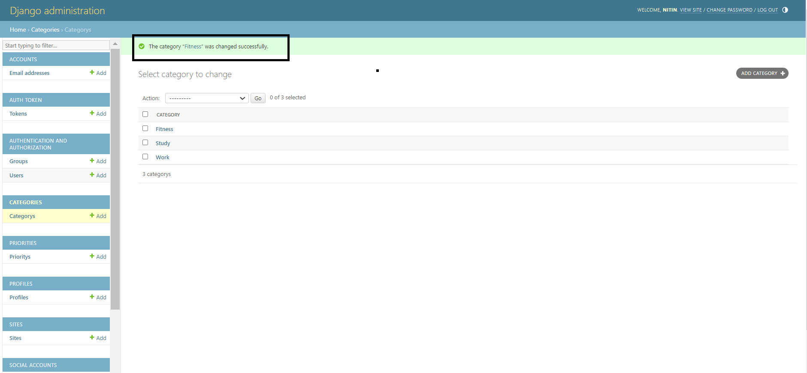
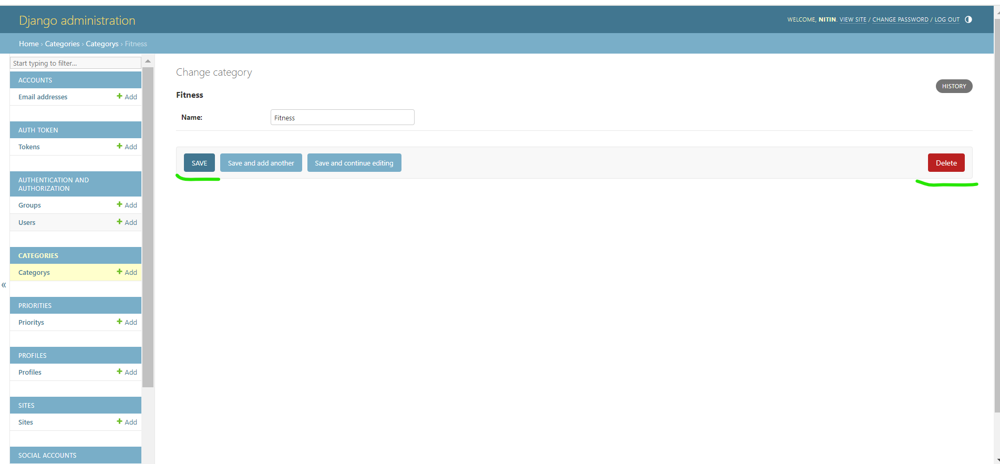

# Anto-Productivity-App-Backend in DRF

**Developer: Anthony Raj**

💻 [Live link]()

This repository contains the API set up using Django REST Framework for the Anto-Productivity-App front-end application ([repository here](https://github.com/Anthonyrajlucas/anto-productivity-app-backend) and [live website here](https://anto-productivity-app-backend-6c122e357cb1.herokuapp.com/))

## Table of Contents
  - [User Stories](#user-stories)
  - [Database](#database)
  - [Technologies Used](#technologies-used)
  - [Validation](#validation)
  - [Testing](#testing)
  - [Credits](#credits)

## User Stories

- The back-end section of the project focuses on its administration side and covers one user story:

- As an admin, I want to be able to create, edit, and delete users, tasks, task statuses, categories, priorities, and statuses. so that I can have control over the content of the application and also remove any potentially inappropriate content.

## Database

The following models were created to represent the database model structure of the application:

#### User Model

- The User model contains information about the user. It is part of the Django all auth library.
- One-to-one relation with the Profile model owner field
- ForeignKey relation with the Task model owner
- ForeignKey relation with the TaskStatus model

#### Profile Model

- The Profile model contains the following fields: owner, name, created_on, updated_on, and an image

- One-to-one relation between the owner field and user ID field

#### Task Model

- The Task model contains the following fields: owner, created_on, title, description, due_date,is_overdue,updated_on, priority, category, and assigned_to.
- ForeignKey relation with the owner field
- ForeignKey relation with the assigned_to field
- ForeignKey relation with the priority field
- ForeignKey relation with the category field
- ForeignKey relation with the status field
- ForeignKey relation between the owner field and the User ID field

#### TaskStatus Model
- The TaskStatus model contains the following fields: owner, created_at, updated_at, state, task, and profile_id.
- ForeignKey relation with the owner field
- ForeignKey relation between the owner field and the User id field
- ForeignKey relation with the Task

#### Category Model
- The Category model contains the following fields: id and name.

#### Priority Model
- The Priority model contains the following fields: id and name.

#### Priority Model
- The Priority model contains the following fields: id and name.

#### Status Model
- The Status model contains the following fields: id and name.

## Technologies Used

- Languages & Frameworks
- Python
- Django

### Languages & Frameworks

- Python
- Django

### Libraries & Tools

- [Cloudinary](https://cloudinary.com/) - File storage. Justification: I used this to store static files
- [Graphviz](https://dreampuf.github.io/GraphvizOnline/) - Image generator. Justification: I used this used for the database model diagram
- [Git](https://git-scm.com/) - Version control system. Justification: I used this for version control and to push the code to GitHub
- [GitHub](https://github.com/) - Cloud based hosting service. Justification: I used this as a remote repository to store project code
- [Gitpod](https://gitpod.io/workspaces) - Cloud development environment. Justification: I used this to host a virtual workspace
- [Heroku](https://heroku.com) - Cloud platform. Justification: I used this was used to deploy the project into live environment
- [Django REST Framework](https://www.django-rest-framework.org/) - API toolkit. Justification: I used this to build the back-end API
- [Django AllAuth](https://django-allauth.readthedocs.io/en/latest/index.html) - API Module. Justification: I used this for user authentication
- [Psycopg2](https://www.psycopg.org/docs/) - PostgreSQL database adaptor. Justification: This was used as a PostgreSQL database adapter for Python
- [ElephantSQL](https://www.elephantsql.com/) - Database hosting service – Justification: This was used as the deployed project on Heroku uses an ElephantSQL database

##### Back to [top](#table-of-contents)

## Validation

### Python Validation

### Python
The python code was tested using [PEP8ci](https://pep8ci.herokuapp.com/) validator. 

**Pep8 results:** 

Main app

* **settings.py** 

* **url.py** 

* **view.py** 

Priorities app

* **view.py** 

## Testing

The following tests were carried out on the app:
1. Manual testing of user stories

### Manual testing of user stories

- As an admin, I want to be able to create, edit and delete the users, posts, comments and likes, so that I can have a control over the content of the application and remove any potential inappropriate content

**Test** | **Action** | **Expected Result** | **Actual Result**
-------- | ------------------- | ------------------- | -----------------
User | Create, update & delete user | A user can be created, edited or deleted | Works as expected
User | Change permissions | User permissions can be updated | Works as expected
Profile | Create, update & delete | User profile can be created, edited or deleted | Works as expected
Task | Create, update & delete | A Task can be created, edited or deleted | Works as expected
My Invention task | Create, edit & delete | my invention task can be created, edited or deleted | Works as expected
 | profiles |  A profiles relationship between a Task and a User can be delete profile, update profile and upload image | Works as expected
My duty task | update status | A dusty task can be update status, save and cancel | Works as expected

In addition, tasks, my invention task, my duty task and profiles can be created by logged-in users only. Users can only update or delete the content which was created by themselves.

Screenshots - Categery

    

Category

    
     
    
     
    
     
    

Screenshots - Priority

    

Priority

    
     
    
     
    
     
    
     
    

    

    

Screenshots -Profile

    

Profile

    
     
    
     
    
     
    

  

Screenshots-Status

   

Status

    
     
    
     
    
     
   

  

    

Screenshots-Task

    

Task

    
     
    
    

    

    

Screenshots-Task Status

    

Task Status

    
     
    
    

    

     

Screenshot-User Model

    

User Model

    
     
    
     
     
    
     
    

    

##### Back to [top](#table-of-contents)

## Credits

### Code

- This project was created based on the Code Institute's Django REST API walkthrough project ['Moments'](https://github.com/Code-Institute-Solutions/drf-api).
- Code Institute tutor Mr.John support who helped with the many issues I had during this project.

##### Back to [top](#table-of-contents)

